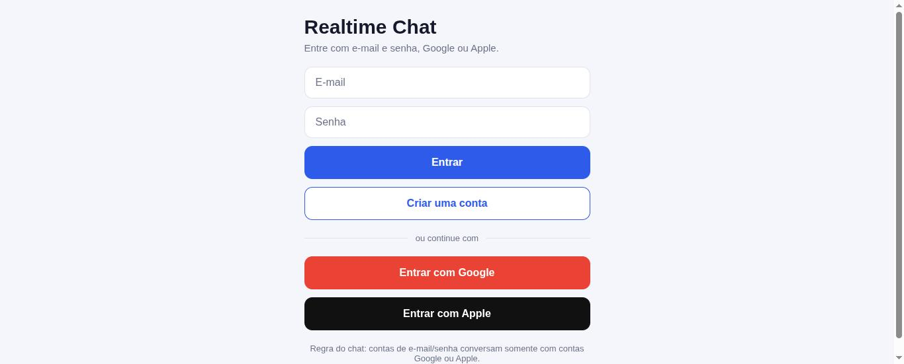
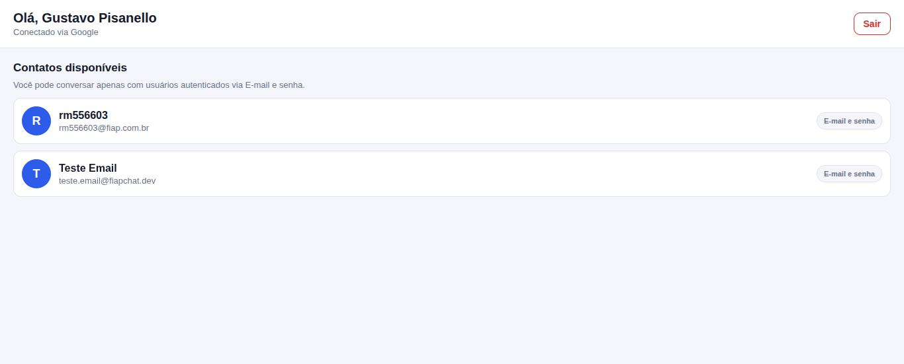
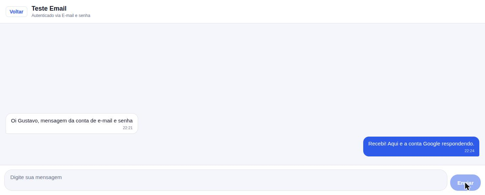

# Realtime Chat — CP1 React Native

Aplicativo de chat **1 para 1 em tempo real**, desenvolvido em React Native com Expo e TypeScript,
usando **Firebase Authentication** (e-mail/senha, Google e Apple) e **Firebase Realtime Database**.

## Integrantes

- RM556603 - Gustavo Laur Pisanello
- RM555211 - Leonardo de Farias

## Descrição

O usuário se autentica por um dos três provedores e vê apenas os contatos compatíveis com a
**regra de comunicação entre provedores** exigida no enunciado:

```
E-mail/Senha  ↔  Google
E-mail/Senha  ↔  Apple
```

Combinações não permitidas (e que nunca aparecem na lista de contatos): E-mail/Senha ↔ E-mail/Senha,
Google ↔ Google, Apple ↔ Apple e Google ↔ Apple. O usuário também nunca aparece para si mesmo.

Cada conversa possui **exatamente dois participantes**. O id da conversa é determinístico
(`uidA_uidB`, com os uids ordenados), o que garante que os dois lados abram sempre a mesma conversa
e permite que as regras de segurança validem o acesso apenas pelo nome do nó.

As mensagens são gravadas no Realtime Database e chegam ao outro participante por meio de um
listener (`onValue`), sem recarregar a tela e sem botão de atualizar. Os listeners são removidos no
cleanup dos `useEffect`.

## Tecnologias utilizadas

- React Native 0.86
- **Expo SDK 57** (`expo ~57.0.16`)
- TypeScript 6 (modo `strict`, projeto sem `any`)
- Expo Router (navegação por arquivos)
- Firebase JS SDK 12 — Authentication + Realtime Database
- `expo-auth-session` (login Google no nativo) e `expo-apple-authentication` (login Apple no iOS)
- `@react-native-async-storage/async-storage` (persistência da sessão)

## Serviços Firebase utilizados

| Serviço | Uso |
| --- | --- |
| Firebase Authentication | Cadastro e login por e-mail/senha, Google e Apple; identificação pelo `uid` |
| Firebase Realtime Database | Perfis de usuário, conversas e mensagens com sincronização em tempo real |

> O projeto **não utiliza Cloud Firestore**.

## Como executar

```bash
npm install
npx expo start
```

- **Web:** `npm run web` (login por e-mail/senha, Google e Apple funcionam via popup)
- **Android:** `npm run android`
- **iOS:** `npm run ios`

### Sobre o Expo Go

| Provedor | Expo Go (Android/iOS) | Web | Development build |
| --- | --- | --- | --- |
| E-mail e senha | ✅ | ✅ | ✅ |
| Google | ❌ (o Google não aceita o redirect `exp://`) | ✅ | ✅ |
| Apple | ✅ (somente iOS) | ✅ | ✅ (somente iOS) |

O login com Google no aparelho depende de um redirect URI com o esquema do app (`realtimechat://`),
que o Expo Go não consegue registrar. Para testar no dispositivo use um development build:

```bash
npx expo run:android   # ou npx expo run:ios
```

## Configuração do Firebase

1. No [console do Firebase](https://console.firebase.google.com), crie o projeto e registre um app Web.
2. Copie as credenciais para `src/config/firebase.ts` (inclusive a `databaseURL`).
3. Em **Authentication → Sign-in method**, habilite **E-mail/senha**, **Google** e **Apple**.
4. Em **Realtime Database**, crie o banco e publique as regras de `database.rules.json`:

```bash
npx firebase-tools login
npx firebase-tools deploy --only database
```

   (ou cole o conteúdo do arquivo na aba **Regras** do console).

5. Para o login com Google no dispositivo, crie os OAuth Client IDs (iOS e Android) no Google Cloud
   e preencha `expo.extra.googleClientIdIos` / `googleClientIdAndroid` em `app.json`.
   O client ID Web já configurado é usado na versão web e como fallback.

### Regras de segurança

O banco **não fica aberto**. As regras publicadas em `database.rules.json` garantem que:

- `users`: leitura apenas para autenticados; cada usuário só escreve o próprio perfil.
- `conversations` e `messages`: leitura e escrita apenas para quem faz parte do id da conversa.
- Uma mensagem só pode ser criada com `senderId` igual ao `auth.uid`, com o destinatário sendo o
  outro participante da conversa, e **respeitando a regra entre provedores** (um dos dois lados
  precisa ser `password`).
- Mensagens não podem ser editadas nem apagadas depois de criadas.

## Estrutura do projeto

```
src/
  app/                         # rotas do Expo Router
    _layout.tsx                # SafeAreaProvider + AuthProvider + Stack
    index.tsx                  # redireciona conforme a sessão
    login.tsx
    (app)/_layout.tsx          # rotas protegidas (sem sessão volta para /login)
    (app)/users.tsx
    (app)/chat/[contactId].tsx

  components/                  # componentes reutilizáveis
    AppButton.tsx  ChatInput.tsx  EmptyState.tsx
    ErrorMessage.tsx  Loading.tsx  MessageBubble.tsx  UserItem.tsx

  contexts/
    AuthContext.tsx            # sessão, ações de login/logout, loading e erros

  hooks/
    useAuth.ts                 # acesso ao contexto de autenticação
    useContacts.ts             # contatos compatíveis, em tempo real (useMemo)
    useChat.ts                 # mensagens em tempo real + envio (useCallback)

  screens/
    LoginScreen.tsx  UsersScreen.tsx  ChatScreen.tsx

  services/                    # toda a comunicação com o Firebase
    authService.ts             # cadastro, login (3 provedores) e logout
    chatService.ts             # criar/localizar conversa, enviar e escutar mensagens
    userService.ts             # perfis dos usuários

  types/
    user.ts  chat.ts  firebase-auth.d.ts

  utils/
    chatRules.ts               # regra entre provedores e id da conversa
    errors.ts                  # mensagens de erro amigáveis

  config/firebase.ts           # inicialização do Firebase
  theme/colors.ts

database.rules.json            # regras de segurança do Realtime Database
```

## Estrutura de dados no Realtime Database

```
users
  └── uid
       ├── name
       ├── email
       ├── provider          // 'password' | 'google' | 'apple'
       └── createdAt

conversations
  └── uidA_uidB
       ├── participants      // [uidA, uidB]
       └── createdAt

messages
  └── uidA_uidB
       └── messageId
            ├── senderId
            ├── receiverId
            ├── text
            └── createdAt
```

## Requisitos técnicos atendidos

- **Hooks:** `useState`, `useEffect` (listeners do Realtime Database com cleanup), `useMemo`
  (filtro de contatos, id da conversa, inversão da lista) e `useCallback` (ações de autenticação e envio).
- **TypeScript:** componentes, props, estados, serviços e dados do Firebase tipados; nenhum `any`
  (os retornos do Realtime Database são validados por type guards antes de virar `ChatUser` / `ChatMessage`).
- **Imutabilidade:** o estado nunca é mutado — listas são sempre recriadas.
- **Estados tratados:** loading, erro, usuário não autenticado, nenhum contato disponível,
  conversa sem mensagens e falha no envio da mensagem.

## Prints da aplicação

### Tela de Login

Campos de e-mail e senha, alternância entre login e cadastro, botões de Google e Apple.



### Tela de Usuários / Contatos

Conta autenticada via **Google** enxergando apenas contatos de **e-mail e senha**, com o badge do
provedor em cada item.



### Tela de Chat

Conversa entre a conta Google e a conta de e-mail/senha. Mensagem recebida em branco à esquerda,
mensagem enviada em azul à direita.


